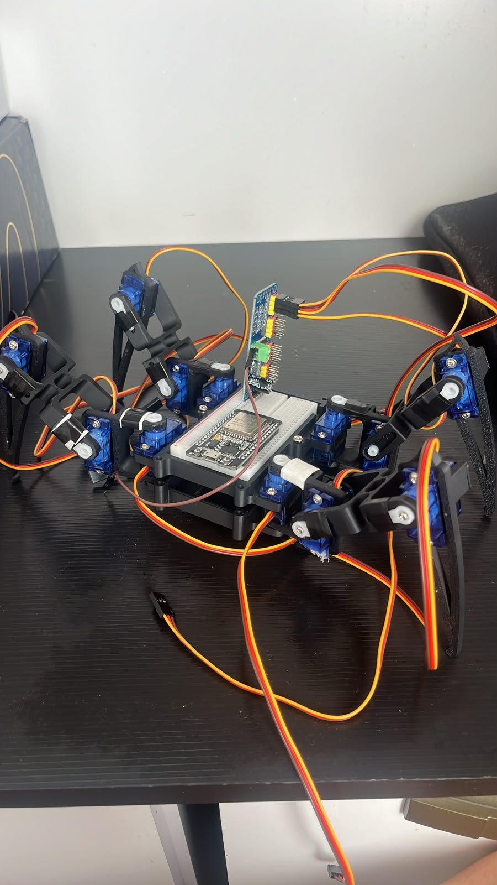

# Aranha-Robotica 

Protótipo de Aranha Quadrúpede controlada remotamente a fim de aprimorar o uso da esp32 e o conhecimento de servo motores.

Componentes utilizados: Esp32; Placa de ensaio; PCA9685 Driver; Micro servo motores; Fonte de alimentação 5v 5A; Conector P4 Borne Fêmea; Chassi Quadrúpede.

Como funciona: A aranha robótica é controlada pelo Wi-Fi através do aplicativo Blynk. Foi criada uma interface no aplicativo com 4 botões de direção: frente, trás, esquerda, direita; um botão interruptor onde OFF leva a aranha para a posição descansar, e ON para ligada (em pé) e por fim, um botão "acenar" que ao ser clicado, faz a aranha dar "tchau".

Próximos passos:
- Adicionar uma tela OLED 0.96 para criar uma face para a aranha
- Adicionar sensores de toque capacitivo Ttp223 para reagir com a face à alguns toques como carinho na barriga.

